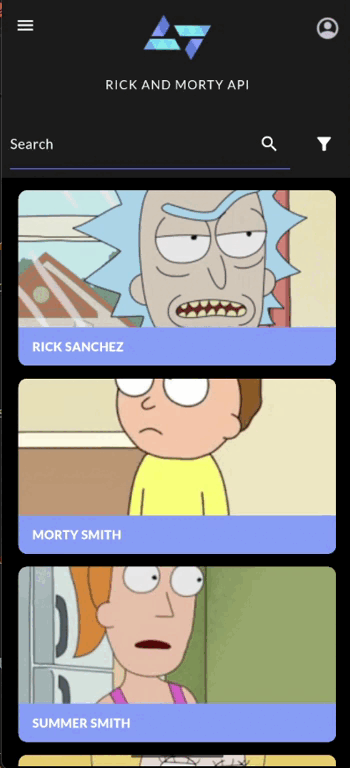
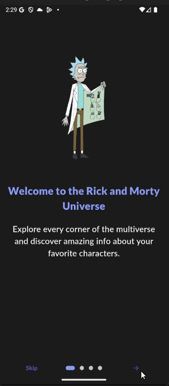
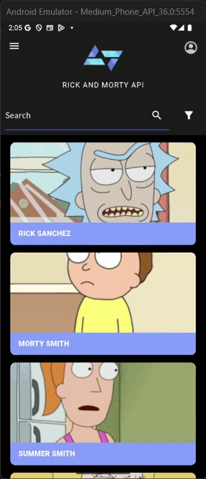
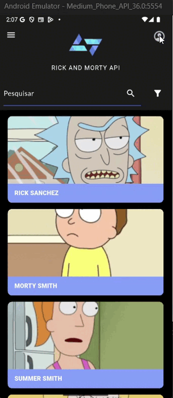

# Desafio Técnico – Kode Start 2025 🚀

Este repositório contém a solução do desafio técnico proposto pela Kobe Apps para o programa **Kode Start 2025**. O desafio consiste no desenvolvimento de um aplicativo Flutter que consome a API REST pública de **Rick and Morty**, apresentando uma listagem de personagens, seus detalhes e aplicando boas práticas de desenvolvimento mobile.

---

## 📱 Funcionalidades Implementadas

### ✅ Funcionalidades Obrigatórias (Fidelidade ao Figma)

#### 🎯 Navegação e Exibição dos Personagens

- A lista permite navegação contínua por meio de scroll, facilitando o acesso a todos os personagens.
- Cada card exibe o nome e a imagem do personagem seguindo fielmente o design do Figma, com a tipografia replicada exatamente, além do posicionamento preciso da imagem no card e o espaçamento adequado entre os elementos e o tamanho dos mesmo, para manter a harmonia visual do layout original.
- Os cards são organizados verticalmente, proporcionando uma rolagem suave e intuitiva.


#### 🔍 Tela de Detalhes do Personagem

- Apresenta o nome, a imagem, a espécie, o gênero, o status, a origem, a última localização e a primeira aparição do personagem.
- A imagem fica sobreposta ao card, exatamente como no layout do Figma, garantindo uma aparência fiel ao design original.
- O status do personagem é indicado por um circulo colorido: verde quando está vivo, vermelho se estiver morto e cinza quando o status é desconhecido.
- Todas as informações são exibidas de forma clara e organizada, seguindo fielmente o design do Figma, com tipografia replicada exatamente, incluindo estilos como blalck, medium, regular e light, além do espaçamento preciso entre palavras e linhas, garantindo a mesma harmonia visual do projeto original.


#### 🔄 Navegação entre Telas

- Navegação fluida e intuitiva entre a lista de personagens e a tela de detalhes.
- Ao tocar em um card, o usuário é direcionado para a tela com informações detalhadas do personagem.
- Transições suaves mantêm a consistência visual e uma experiência agradável.
- Foi adicionada uma forma prática de voltar para a lista clicando no logo, facilitando a navegação.


---


### 💡 Recursos Extras

#### 🌅 Tela de Splash
- Implementação de uma splash screen elegante que aparece ao abrir o aplicativo.
- A tela inicial exibe a logo e uma img do tema do app, criando uma primeira impressão profissional.
- A splash screen tem duração controlada para garantir carregamento suave dos recursos.
- Essa funcionalidade contribui para uma experiência de usuário mais fluida e agradável desde o início.


#### 🔍 Busca por Nome
- Permite pesquisar personagens digitando o nome completo ou apenas parte dele.
- O sistema retorna resultados em tempo real, facilitando a localização do personagem desejado.
- A busca é sensível a trechos do nome, tornando a experiência mais prática e eficiente.




#### 🗂️ Filtro Avançado de Personagens
- Permite refinar a lista de personagens aplicando filtros combinados para facilitar a busca.
- Status: Filtra pelos estados Alive, Dead ou Unknown.
- Species: Mostra apenas personagens da espécie selecionada.
- Type: Exibe resultados de acordo com o tipo especificado.
- Gender: Filtra conforme o gênero escolhido.
- Os filtros podem ser utilizados junto com a busca por nome, seja parcial ou completa, tornando a localização dos personagens ainda mais rápida e precisa.


#### 📖 Telas de Introdução (Intro Pages)
- Apresenta um conjunto de páginas introdutórias que guiam o usuário ao abrir o app pela primeira vez.
- Cada página contém título, descrição e imagem ilustrativa, transmitindo as principais funcionalidades e propósitos do app.
- Possui navegação simples com botões para avançar, voltar ou pular a introdução a qualquer momento.
- Utiliza indicadores visuais para mostrar o progresso da navegação pelas páginas.
- Após finalizar a introdução, o usuário é redirecionado automaticamente para a tela de login, iniciando a experiência principal do app.



#### 🔐 Tela de Login e Cadastro

- **Login:** Permite autenticação do usuário via email e senha com integração ao Firebase Authentication, além de login social com Google. Inclui campos com controle para mostrar/ocultar senha, validação de entradas e mensagens claras de erro. Após login bem-sucedido, redireciona para a HomePage e salva dados no Firestore. A interface é responsiva, multilíngue e mantém consistência visual com o app.

- **Cadastro:** Permite criar nova conta com nome, email, senha e foto de perfil opcional, escolhida da galeria e convertida para base64 para armazenamento seguro no Firestore. Realiza validações e exibe mensagens de erro amigáveis. Durante o cadastro, apresenta diálogo de progresso e confirma sucesso com alerta. Inclui controle para mostrar/esconder senha e adapta cores para modo claro/escuro, garantindo uma experiência fluida para novos usuários.

  

#### 🌐 Internacionalização, Troca de Tema e Navigation Drawer

- **Troca de Linguagem:** O app suporta internacionalização com arquivos JSON para português (pt_BR) e inglês (en_US), permitindo alternar facilmente entre os idiomas. A troca é feita de forma dinâmica, atualizando todos os textos da interface sem reiniciar o app, garantindo acessibilidade para usuários de diferentes idiomas.

- **Troca de Tema:** Implementa um sistema de tema claro e escuro gerenciado pelo `ThemeController`. O usuário pode alternar entre os temas via um switch no menu lateral, e a interface responde instantaneamente às mudanças, mantendo a consistência visual e melhorando a experiência conforme a preferência do usuário. Importante destacar que a troca não foi implementada da maneira tradicional, pois ao usar o Material 3, há uma leve alteração automática no tom das cores, o que exige cuidados para manter a harmonia visual desejada no app.

- **NavigationDrawerComponent:** O menu lateral é um componente personalizado que oferece navegação rápida e organizada. Exibe foto e email do usuário (carregados do Firestore), controles para alternar tema e idioma, além de botão para logout integrado ao Firebase Auth. Utiliza `Provider` para gerenciamento reativo do estado e adapta o visual conforme o tema ativo, garantindo usabilidade e manutenção facilitadas.



#### 👤 Tela de Perfil e Favoritos

- Exibe as informações do usuário autenticado, email e foto de perfil (armazenada em base64 no Firestore), garantindo uma experiência personalizada.   
- A interface adapta-se aos modos claro e escuro, mantendo a consistência visual. Também apresenta indicadores de carregamento e tratamento de erros para garantir uma navegação fluida e confiável.  
- Lista os personagens favoritos do usuário em uma seção expansível, onde os favoritos são marcados com um ícone de coração nos cards exibidos na HomePage ou na tela de detalhes.  
- Ao favoritar um personagem, ele é salvo no Firestore associado ao usuário autenticado. Na tela de perfil, esses personagens favoritos aparecem organizados em uma lista expansível, permitindo que o usuário visualize rapidamente seus favoritos e acesse os detalhes com facilidade.  
- Essa funcionalidade oferece uma experiência personalizada e mantém o usuário engajado com seus personagens preferidos.




---

## 🧠 Decisões Técnicas e Justificativas

### 🌐 Arquitetura - MVC (Model-View-Controller)  
Escolhi o padrão **MVC** por oferecer uma clara separação de responsabilidades entre as camadas de dados, interface e lógica de negócio. Essa estrutura facilita a organização do código, tornando-o mais modular e fácil de manter. Além disso, o MVC permite reutilização dos componentes e simplifica a realização de testes. Por ser um padrão que estudei profundamente e já apliquei em projetos anteriores, trouxe mais segurança e eficiência ao desenvolvimento.

### 📡 Requisições HTTP  
Utilizei o pacote `http` por ser uma solução leve, simples e amplamente utilizada para comunicação REST em Flutter. A familiaridade adquirida durante a faculdade com essa biblioteca permitiu um desenvolvimento mais rápido e com menos complexidade, garantindo o consumo eficiente da API pública do Rick and Morty.

### 🛠️ Gerenciamento de Estado  
Optei por manter o gerenciamento de estado simples, utilizando `setState`, por conta da natureza do desafio e do escopo do projeto. Essa abordagem direta atende bem às necessidades da aplicação sem adicionar complexidade desnecessária. Também reflete o método que usei em meu TCC, o que contribui para uma implementação mais natural e consistente com meu conhecimento.

### 📄 Organização do Projeto  
A divisão em pastas seguindo o padrão MVC foi pensada para facilitar a escalabilidade, manutenção e compreensão do projeto. Essa organização deixa o código mais limpo, favorece o trabalho em equipe e permite a extensão do app com novas funcionalidades sem grandes retrabalhos.

### ⚡ Pacotes e Dependências  

#### Firebase  
- Usei o conjunto de pacotes do Firebase (`firebase_core`, `firebase_auth`, `cloud_firestore`, `firebase_storage`, `google_sign_in`) para implementar autenticação, armazenamento e banco de dados em nuvem. Essa escolha garantiu uma infraestrutura robusta e escalável, facilitando a gestão dos usuários e seus dados, além de permitir login social e armazenamento seguro de fotos.

#### API e HTTP  
- O pacote `http` foi utilizado para realizar as requisições REST à API do Rick and Morty. É uma biblioteca simples e eficiente, ideal para o consumo da API pública com tratamento adequado de respostas.

#### UI e Componentes  
- `provider`: Escolhido para o gerenciamento de estado reativo e simples, permitindo atualização de UI a partir das mudanças nos dados.  
- `flutter_translate`: Implementa a internacionalização, possibilitando troca dinâmica de idiomas, ampliando o alcance e acessibilidade do app.  
- `flutter_multi_select_items`: Facilita a criação de filtros avançados com seleção múltipla, aprimorando a experiência do usuário na busca por personagens.  
- `sign_button`: Simplifica a implementação dos botões de login social, garantindo aparência padronizada e funcionalidade integrada.  
- `image_picker`: Permite que usuários selecionem imagens para perfil diretamente da galeria, melhorando a personalização do app.  
- `introduction_screen`: Facilita a criação das telas de onboarding, oferecendo uma experiência inicial intuitiva e visualmente atraente.

Essa combinação de pacotes foi selecionada cuidadosamente para equilibrar funcionalidade, simplicidade e performance, além de promover um desenvolvimento eficiente e sustentável.


<pre style="background:#f5f5f5; padding:10px; border-radius:5px; font-family: monospace;">
projeto_final/
├── assets/
│   ├── fonts/
│   ├── imgs/
│   └── i18n/
│   
├── lib/
│   │
│   ├── components/
│   │   ├── appbar_component.dart
│   │   ├── card_character_component.dart
│   │   ├── detailed_character_card_component.dart
│   │   └── navigation_drawer_component.dart
│   │
│   ├── models/
│   │   ├── detailed_character.dart
│   │   ├── detailed_episode.dart
│   │   └── paginated_characters.dart
│   │
│   ├── controllers/
│   │   ├── rickandmorty_controller.dart
│   │   ├── theme_controller.dart
│   │   └── character_controller.dart
│   │
│   ├── views/
│   │   ├── details_page.dart
│   │   ├── home_page.dart
│   │   ├── intro_pages.dart
│   │   ├── login_page.dart
│   │   ├── profile_page.dart
│   │   ├── signup_page.dart
│   │   └── splash_page.dart
│   │
│   ├── theme/
│   │   ├── app_colors.dart
│   │   └── app_images.dart
│   │
│   └── main.dart
└── pubspec.yaml
</pre>


Essa divisão visa facilitar a manutenção, entendimento e escalabilidade do projeto.

---

### 🔍 Explicação das Camadas do Projeto

O projeto segue o padrão **MVC (Model-View-Controller)**, garantindo separação clara de responsabilidades. Abaixo, a descrição de cada camada:

---

#### **assets/**  
- **fonts/**  
  Contém as fontes usadas no projeto, seguindo o padrão visual do Figma:  
  `Lato-Black.ttf`, `Lato-Light.ttf`, `Lato-Medium.ttf` e `Lato-Regular.ttf`.  
  Isso assegura consistência e fidelidade ao design.

- **i18n/**  
  Arquivos de tradução para suporte multilíngue, com `en_US.json` e `pt_BR.json`.  
  Facilita a adaptação do app para diferentes idiomas.

- **imgs/**  
  Centraliza todas as imagens do projeto, como ícones, logos e recursos visuais.

---

#### **lib/components/**  
Contém componentes reutilizáveis (widgets customizados) para manter o código organizado e consistente.

- **appbar_component.dart**  
  Componente da AppBar customizada que adapta ícones, funcionalidades e tema conforme a tela.  
  Integra tradução e mantém a identidade visual em todas as páginas.

- **card_character_component.dart**  
  Exibe um card simples com nome e imagem do personagem. Usa widgets nativos para sombra, bordas e interatividade.

- **detailed_character_card_component.dart**  
  Card detalhado com imagem, nome, status, espécie, gênero, origem e localização.  
  Carrega dados assíncronos (ex: episódios) e adapta-se ao tema claro/escuro.

- **navigation_drawer_component.dart**  
  Menu lateral com foto e email do usuário (carregados do Firestore), opções de tema, idioma e logout.  
  Utiliza gerenciamento de estado e suporte a temas para melhor experiência.

---

#### **lib/models/**  
Modelos de dados que representam as entidades da aplicação, facilitando manipulação e integração com APIs.

- **detailed_character.dart**  
  Representa detalhes completos do personagem, incluindo atributos e métodos de serialização JSON.

- **detailed_episode.dart**  
  Representa episódios com dados como nome, data, código e personagens relacionados.

- **paginated_characters.dart**  
  Estrutura para lidar com respostas paginadas da API, organizando dados e paginação.

---

#### **lib/controllers/**  
Controladores que gerenciam a lógica do app, comunicação com API e estado.

- **rickandmorty_controller.dart**  
  Faz requisições à API Rick and Morty, buscando personagens, detalhes e episódios.  
  Trata dados e os converte para modelos do app.

- **theme_controller.dart**  
  Gerencia o estado do tema (claro/escuro) com notificação reativa para atualização da UI.

- **character_controller.dart**  
  Controla operações CRUD de personagens no Firestore, vinculados ao usuário autenticado.

---

#### **lib/views/**  
Telas do app que compõem a interface e experiência do usuário.

- **details_page.dart**  
  Exibe detalhes completos de um personagem, permite favoritar, e trata carregamento e erros.  
  Usa FutureBuilder para dados assíncronos e adapta visual ao tema.

- **home_page.dart**  
  Lista paginada de personagens com busca, filtros e scroll infinito. Navega para detalhes ao tocar em cards.

- **intro_pages.dart**  
  Tela de introdução com páginas informativas, usando pacote IntroductionScreen e suporte a múltiplos idiomas.

- **login_page.dart**  
  Tela de login com autenticação via email/senha e Google, integração com Firebase Auth e Firestore.

- **profile_page.dart**  
  Mostra informações do usuário e lista personagens favoritos, adaptando visual e tratando estados de carregamento.

- **signup_page.dart**  
  Tela para cadastro de usuário, com validações, upload opcional de foto e feedback visual.

- **splash_page.dart**  
  Tela inicial com logo e animação, navegando automaticamente para as intro pages após 3 segundos.

---

#### **lib/theme/**  
Centraliza as definições visuais do app.

- **app_colors.dart**  
  Define as paletas de cores para temas claro e escuro, facilitando a manutenção e consistência visual.

- **app_images.dart**  
  Centraliza os caminhos dos recursos gráficos, evitando strings espalhadas no código e facilitando manutenção.


## 📋 Avaliação e Qualidade da Entrega

Busquei garantir uma **entrega completa e bem documentada**, conforme orientações recebidas:

- Código limpo e legível, com nomes de variáveis e métodos autoexplicativos.
- Comentários nos pontos importantes das decisões de lógica.
- Projeto funcional e testado.
- README explicativo com arquitetura, decisões técnicas e estrutura do projeto.

---

## 🔧 Tecnologias Utilizadas

- **Flutter** 3.29.3 (stable)  
  Framework baseado em [Flutter GitHub](https://github.com/flutter/flutter.git)  
  Revision: ea121f8859 (4 meses atrás - 2025-04-11)  
  Engine revision: cf56914b32  
  Dart 3.7.2 • DevTools 2.42.3

- **Dart** (versão 3.7.2)

- **API REST** pública [Rick and Morty API](https://rickandmortyapi.com/)

- **http** package (para consumo da API)

- **MVC** como padrão arquitetural para organização do código


---
## 🚀 Como Exportar / Gerar o Build do Projeto

Se desejar gerar o arquivo instalável do aplicativo para Android ou iOS, siga as instruções abaixo.

### 📱 Android (APK)

1. Certifique-se que o ambiente Android está configurado, com Android SDK e dispositivo/emulador pronto para testes.  
2. No terminal, na raiz do projeto, rode os comandos:  
   ```bash
   flutter clean
   flutter build apk --release
3. O APK será gerado em:
build/app/outputs/flutter-apk/app-release.apk

4. Instale o APK diretamente no dispositivo ou distribua conforme necessário.

🍏 iOS (IPA)
1. Necessário ter um Mac com Xcode e certificados válidos para assinatura.

2. No terminal, rode:

flutter clean
flutter build ios --release

3. Abra ios/Runner.xcworkspace no Xcode, configure assinatura (Signing & Capabilities) e selecione dispositivo.
4. No Xcode, faça Product > Archive, e no Organizer exporte o arquivo IPA para distribuição ou App Store
---

## 📌 Observações Finais

Estou extremamente entusiasmada com essa oportunidade na Kobe Apps. Desenvolver esse desafio foi uma experiência muito enriquecedora, pois pude aplicar meus conhecimentos em Flutter, reforçar conceitos de arquitetura e boas práticas de desenvolvimento mobile.

Além disso, admirei muito a proposta do desafio em valorizar não só o código, mas também a clareza das decisões e o cuidado com a entrega. Isso me incentivou a buscar uma entrega mais fundamentada e alinhada com um ambiente profissional real.

---

## ✨ Autora

**Brenda Lopes Levandoski**  
Estudante de Ciência da Computação – UNICENTRO  
Flutter | Frontend | UI/UX | Firebase  
[LinkedIn](https://www.linkedin.com/in/brenda-lopes-levandoski/) | [GitHub](https://github.com/lopesbrendinha)
