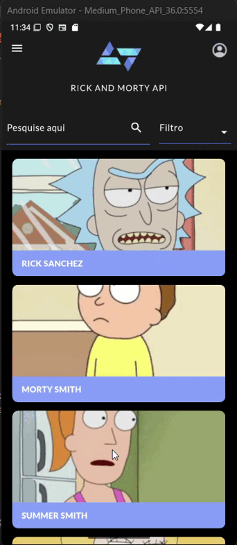
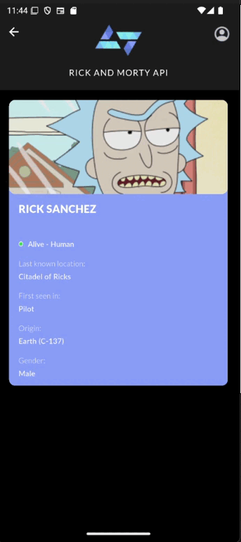

# Desafio Técnico – Kode Start 2025 🚀

Este repositório contém a solução do desafio técnico proposto pela Kobe Apps para o programa **Kode Start 2025**. O desafio consiste no desenvolvimento de um aplicativo Flutter que consome a API REST pública de **Rick and Morty**, apresentando uma listagem de personagens, seus detalhes e aplicando boas práticas de desenvolvimento mobile.

---

## 📱 Funcionalidades Implementadas

### ✅ Funcionalidades Obrigatórias (Fidelidade ao Figma)

#### 🎯 Navegação e Exibição dos Personagens

- A lista permite navegação contínua por meio de scroll, facilitando o acesso a todos os personagens.
- Cada card exibe o nome e a imagem do personagem seguindo fielmente o design do Figma, com a tipografia replicada exatamente, além do posicionamento preciso da imagem no card e o espaçamento adequado entre os elementos e o tamanho dos mesmo, para manter a harmonia visual do layout original.
- Os cards são organizados verticalmente, proporcionando uma rolagem suave e intuitiva.

#### 🔍 Tela de Detalhes do Personagem

- Apresenta o nome, a imagem, a espécie, o gênero, o status, a origem, a última localização e a primeira aparição do personagem.
- A imagem fica sobreposta ao card, exatamente como no layout do Figma, garantindo uma aparência fiel ao design original.
- O status do personagem é indicado por um circulo colorido: verde quando está vivo, vermelho se estiver morto e cinza quando o status é desconhecido.
- Todas as informações são exibidas de forma clara e organizada, seguindo fielmente o design do Figma, com tipografia replicada exatamente, incluindo estilos como blalck, medium, regular e light, além do espaçamento preciso entre palavras e linhas, garantindo a mesma harmonia visual do projeto original.

#### 🔄 Navegação entre Telas

- Navegação fluida e intuitiva entre a lista de personagens e a tela de detalhes.
- Ao tocar em um card, o usuário é direcionado para a tela com informações detalhadas do personagem.
- Transições suaves mantêm a consistência visual e uma experiência agradável.
- Foi adicionada uma forma prática de voltar para a lista clicando no logo, facilitando a navegação.

---

### 💡 Recursos Extras

#### 🌅 Tela de Splash
- Implementação de uma splash screen elegante que aparece ao abrir o aplicativo.
- A tela inicial exibe a logo e uma img do tema do app, criando uma primeira impressão profissional.
- A splash screen tem duração controlada para garantir carregamento suave dos recursos.
- Essa funcionalidade contribui para uma experiência de usuário mais fluida e agradável desde o início.

#### 🔍 Busca por Nome
- Permite pesquisar personagens digitando o nome completo ou apenas parte dele.
- O sistema retorna resultados em tempo real, facilitando a localização do personagem desejado.
- A busca é sensível a trechos do nome, tornando a experiência mais prática e eficiente.

#### 🗂️ Filtro Avançado de Personagens
- Permite refinar a lista de personagens aplicando filtros combinados para facilitar a busca.
- Status: Filtra pelos estados Alive, Dead ou Unknown.
- Species: Mostra apenas personagens da espécie selecionada.
- Type: Exibe resultados de acordo com o tipo especificado.
- Gender: Filtra conforme o gênero escolhido.
- Os filtros podem ser utilizados junto com a busca por nome, seja parcial ou completa, tornando a localização dos personagens ainda mais rápida e precisa.

---

## 🧠 Decisões Técnicas e Justificativas

### 🌐 Arquitetura - MVC (Model-View-Controller)
Optei por utilizar o padrão **MVC** pela sua clareza na separação de responsabilidades e também foi o padrão que mais estudei:

- **Model:** Responsável por representar os dados (ex: 'detailed_character.dart').
- **View:** Interface com o usuário, implementada com `Widgets` declarativos.
- **Controller:** Lógica de negócio e mediação entre model e view.

Essa estrutura torna o código mais organizado, reutilizável e de fácil manutenção, assim facilitando testes, leitura e escalabilidade.

### 📡 Requisições HTTP
Utilizei o pacote `http` para realizar chamadas REST à API do Rick and Morty, por ser leve, simples e foi o método que estudei na faculdade, assim estava mais familiarizado com ele.

### 🛠️ Gerenciamento de Estado
O estado foi mantido simples (com `setState`) devido à natureza do desafio, que prioriza boas práticas fundamentais. Essa abordagem também foi utilizada no meu TCC, o que torna mais natural e eficiente para eu aplicá-la neste projeto.

### 📄 Organização do Projeto
O projeto foi dividido em pastas conforme o padrão MVC:

<pre style="background:#f5f5f5; padding:10px; border-radius:5px; font-family: monospace;">
projeto_final/
├── assets/
│   ├── fonts/
│   └── imgs/
├── lib/
│   ├── models/
│   │   └── character_model.dart
│   ├── controllers/
│   │   └── character_controller.dart
│   ├── views/
│   │   ├── home_page.dart
│   │   └── character_detail_page.dart
│   ├── services/
│   │   └── api_service.dart
│   ├── theme/
│   │   ├── app_colors.dart
│   │   └── app_images.dart
│   └── main.dart
└── pubspec.yaml
</pre>

Essa divisão visa facilitar a manutenção, entendimento e escalabilidade do projeto.

---

### 🔍 Explicação das Camadas do Projeto

O projeto segue o padrão MVC (Model-View-Controller), proporcionando uma melhor separação de responsabilidades. Abaixo está a explicação de cada camada:

- **models/**  
  Contém as classes responsáveis por representar os dados da aplicação.  
  Ex: `CharacterModel` define a estrutura de um personagem retornado pela API.

- **controllers/**  
  Gerencia a lógica de negócio e atua como intermediário entre a `View` e o `Model`.  
  Ex: `CharacterController` controla a recuperação dos personagens e o estado da tela.

- **views/**  
  Reúne todas as telas e componentes visuais da aplicação.  
  Ex: `HomePage` exibe a lista de personagens, enquanto `CharacterDetailPage` mostra os detalhes de um personagem selecionado.

- **services/**  
  Responsável pela comunicação com APIs externas e serviços auxiliares.  
  Ex: `ApiService` faz as requisições HTTP à API do Rick and Morty.

- **theme/**  
  Centraliza definições de estilo, como cores e imagens padrão utilizadas pela interface.

- **assets/**  
  Armazena recursos estáticos como imagens e fontes utilizadas pela aplicação.

Essa estrutura ajuda a manter o projeto limpo, modular e preparado para crescer com novas funcionalidades.

## 📋 Avaliação e Qualidade da Entrega

Busquei garantir uma **entrega completa e bem documentada**, conforme orientações recebidas:

- Código limpo e legível, com nomes de variáveis e métodos autoexplicativos.
- Comentários nos pontos importantes das decisões de lógica.
- Projeto funcional e testado.
- README explicativo com arquitetura, decisões técnicas e estrutura do projeto.

---

## 🔧 Tecnologias Utilizadas

- **Flutter** 3.x
- **Dart**
- **API REST** pública [Rick and Morty API](https://rickandmortyapi.com/)
- **http** package
- **MVC** como padrão arquitetural

---

## 📌 Observações Finais

Estou extremamente entusiasmada com essa oportunidade na Kobe Apps. Desenvolver esse desafio foi uma experiência muito enriquecedora, pois pude aplicar meus conhecimentos em Flutter, reforçar conceitos de arquitetura e boas práticas de desenvolvimento mobile.

Além disso, admirei muito a proposta do desafio em valorizar não só o código, mas também a clareza das decisões e o cuidado com a entrega. Isso me incentivou a buscar uma entrega mais fundamentada e alinhada com um ambiente profissional real.

---

## ✨ Autora

**Brenda Lopes Levandoski**  
Estudante de Ciência da Computação – UNICENTRO  
Flutter | Frontend | UI/UX | Firebase  
[LinkedIn](https://www.linkedin.com/in/brenda-lopes-levandoski/) | [GitHub](https://github.com/lopesbrendinha)
